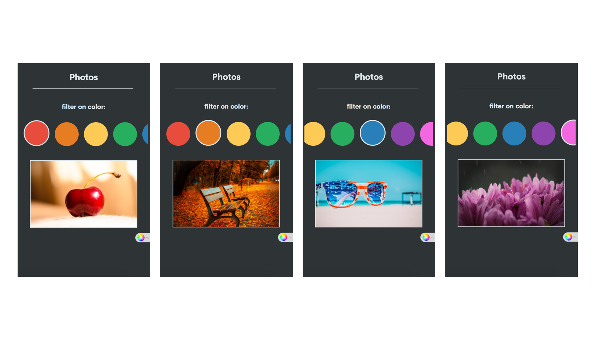
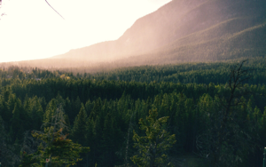
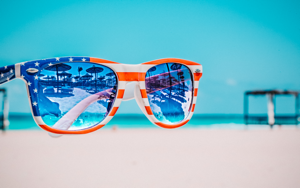
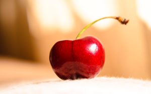
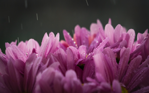
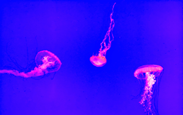
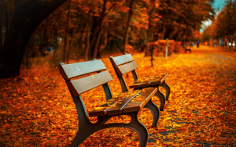
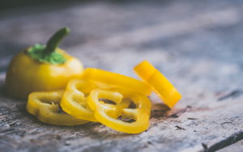
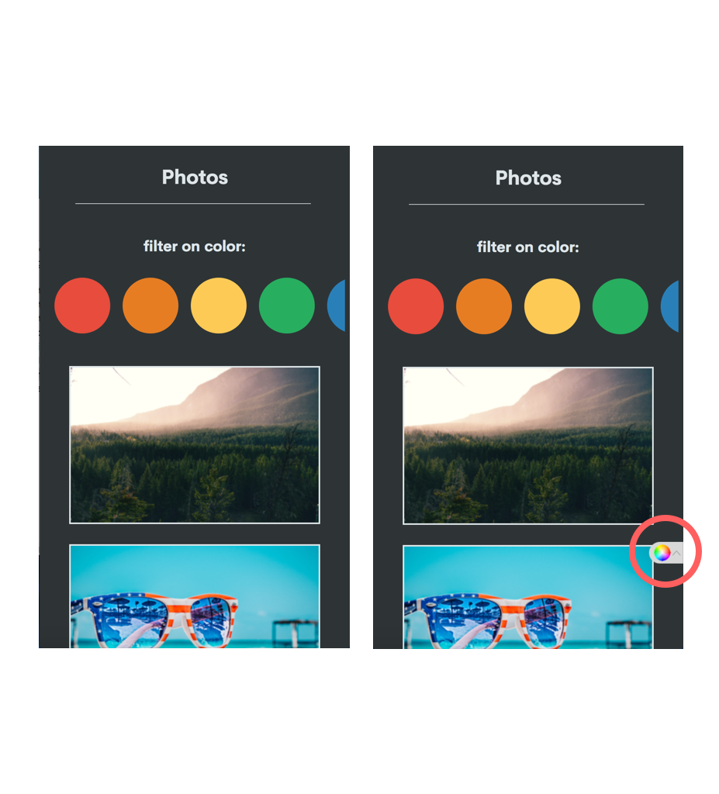
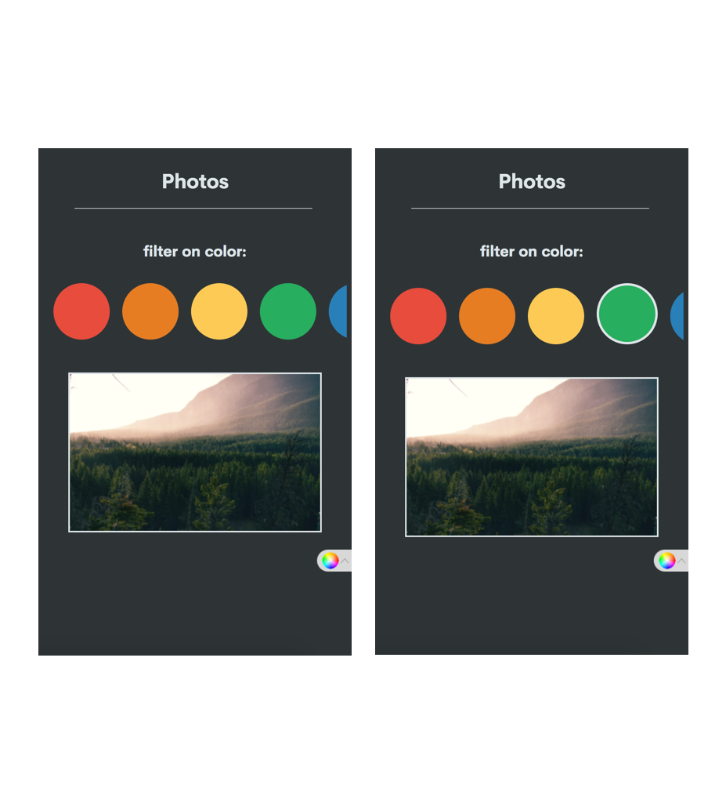

## FFD opdracht 1



Voor de eerste opdracht heb ik gekozen voor de 4e use case:

- Als ik een lijst films heb gevonden, wil ik leuke films kunnen opslaan om ze thuis te ....

- In een lijst gevonden studentenhuizen wil ik details kunnen bekijken om te bepalen of de kamer geschikt is.

- In een verzameling muzieknummers wil ik de volgorde kunnen veranderen om een vette playlist te maken.

- **Als ik foto's zoek wil ik kunnen selecteren op kleur om verassende zoekresultaten te krijgen.**

Voor de opdracht maak ik gebruik van html, css en javascript om een prototype te maken voor de gekozen use case

## How it works

In het gemaakte prototype staan momenteel 7 foto's (1 voor iedere kleur). meer foto's kunnen uiteraard toe worden gevoegd en gekoppeld worden aan een kleur.

De gebruiker kan door de pagina heen scrollen en alle foto's bekijken. Mocht de gebruiker bijvoorbeeld alleen rode afbeeldingen willen zien kan er op het rode bolletje worden geklikt. Dit filtert alle afbeeldingen die niet in de groep rood zitten weg. Zo kan de gebruiker op kleur afbeeldingen vinden

## code

Een aantal stukjes interresante code:

onderstaande code maakt in de html de belangrijke elementen aan, in dit geval de klikbare buttons en de foto's.

De <spans> zijn de ronde kleurknoppen, deze krijgen ieder een class mee zodat de knop later kan worden aangesproken in css en js. Een onclick functie in filter.js wordt aangeroepen, deze functie handelt het filteren zodra er wordt geklikt.

``` html
<div class="colors">

    <span class="redbutton" onclick="displayRed ()"></span>

    <span class="orangebutton" onclick="displayOrange ()"></span>

    <span class="yellowbutton" onclick="displayYellow ()"></span>

    <span class="greenbutton" onclick="displayGreen ()"></span>

    <span class="bluebutton" onclick="displayBlue ()"></span>

    <span class="purplebutton" onclick="displayPurple ()"></span>

    <span class="pinkbutton" onclick="displayPink ()"></span>

</div>

      <a href="#">
        
      </a>

      

      

      

      

      

      

      
```

Alle foto's krijgen een id en een class mee. Id wordt gebruikt om in filter.js de juiste foto te kunnen filteren, de class is voor positionering in css.

Om ervoor te zorgen dat de kleurknoppen naast elkaar te komen staan en je door de kleuren kan scrollen is de volgende code gebruikt:

``` css
.colors {
  overflow: auto;
  white-space: nowrap;
}
```

en

``` css
::-webkit-scrollbar {
display: none;
}
```

Dit laatste zorgt ervoor dat de scrollbar die onstaat bij objecten die buiten het veld vallen verdwijnt.


### javascript

In filter.js staat de code die ervoor zorgt dat de kleuren worden gefilterd

Eerst worden de afbeeldingen in variabelen opgeslagen:

``` javascript
var green = document.getElementById('green');
var blue = document.getElementById('blue');
var red = document.getElementById('red');
var pink = document.getElementById('pink');
var purple = document.getElementById('purple');
var orange = document.getElementById('orange');
var yellow = document.getElementById('yellow');
```

Daarna worden de kleurknoppen in variabelen opgeslagen:

``` javascript
var greenButton = document.querySelector('.greenbutton');
var blueButton = document.querySelector('.bluebutton');
var redButton = document.querySelector('.redbutton');
var pinkButton = document.querySelector('.pinkbutton');
var purpleButton = document.querySelector('.purplebutton');
var orangeButton = document.querySelector('.orangebutton');
var yellowButton = document.querySelector('.yellowbutton');
```

Dan het belangrijkste stuk, het filteren van de juiste afbeeldingen.

Zodra er wordt gedrukt op de groene knop wordt "displayGreen" aangeroepen. Dit zet de afbeelding met groen erin op display: block; en alle andere afbeeldingen op display: none;

``` javascript
function displayGreen () {
  green.style.display = "block";
  blue.style.display = "none";
  red.style.display = "none";
  pink.style.display = "none";
  purple.style.display = "none";
  orange.style.display = "none";
  yellow.style.display = "none";
}
```

Voorbeeld van een andere kleur:

```javascript
function displayPink () {
  green.style.display = "none";
  blue.style.display = "none";
  red.style.display = "none";
  pink.style.display = "block";
  purple.style.display = "none";
  orange.style.display = "none";
  yellow.style.display = "none";
}
```

## Feedback & verbeteringen

Na het testen van het project komen een aantal dingen naar boven die verbeterd kunnen worden, hieronder worden de aanpassingen 1 voor 1 behandeld.

### Oplossing 1

- als je naar beneden scrollt verdwijnen de kleurknoppen, het is handig om snel weer toegang te hebben tot filteren.



Om dit op te lossen heb ik een fixed knop toegevoegd die de gebruiker terug naar de bovenkant van de pagina stuurt. Hier zijn de kleurknoppen weer zichtbaar.

De code:

html
``` html
<a href="#">
  
</a>
```

css
``` css
.colorreturn {
  position: fixed;
  left: 27.8em;
  top: 40em;
}
```


### Oplossing 2

- nadat je klikt op een kleur zie je niet welke kleur je hebt geselecteerd (behalve aan de gefilterde foto's.)
(stom, over het hoofd gezien. Dit had natuurlijk vanaf het begin een feature moeten zijn, het script maken nam iets teveel tijd in beslag).



Om dit op te lossen heb ik een stuk toegevoegd aan de javscript code die filtert na een klik. De code voegt een border toe op de kleurknop waarop wordt geklikt en zet alle andere kleurknoppen op border: none;

``` javascript
function displayGreen () {
  greenButton.style.border = "solid #dfe6e9";
  blueButton.style.border = "none";
  redButton.style.border = "none";
  pinkButton.style.border = "none";
  purpleButton.style.border = "none";
  orangeButton.style.border = "none";
  yellowButton.style.border = "none";

  green.style.display = "block";
  blue.style.display = "none";
  red.style.display = "none";
  pink.style.display = "none";
  purple.style.display = "none";
  orange.style.display = "none";
  yellow.style.display = "none";
}
```


### Oplossing 3

- Na het selecteren van een kleur kan je niet meer terug naar een view met alle kleuren (de pagina refreshen werkt)

Een extra button is toegevoegd (voor nu nog wit), met deze button worden alle afbeeldingen terug gezet naar display: block

``` javascript
function displayAll () {
  allButton.style.border = "solid #000"
  greenButton.style.border = "none";
  blueButton.style.border = "none";
  redButton.style.border = "none";
  pinkButton.style.border = "none";
  purpleButton.style.border = "none";
  orangeButton.style.border = "none";
  yellowButton.style.border = "none";

  green.style.display = "block";
  blue.style.display = "block";
  red.style.display = "block";
  pink.style.display = "block";
  purple.style.display = "block";
  orange.style.display = "block";
  yellow.style.display = "block";
}
```

### Fixed bar on scroll

Op verzoek van koop is er gewerkt aan een extra functie.
de bar met kleuren is vanaf nu ook zichtbaar als er naar beneden wordt gescrolled, de kleurknoppen worden geanimeerd kleiner waardoor de bar minder opvalt. Kleuren zijn nogsteeds te selecteren in deze state. Bij het terug scrollen naar boven krijgen de kleurknoppen weer de normale grootte en ze vallen weer terug op de normale plek.


de code bestaat uit een aantal css en js stappen.
in js worden een aantal variabelen gemaakt:
``` javascript
var header = document.querySelector('.colors'); // selecteert de div waar de kleurknoppen inzitten
var colorButton = document.querySelector('.color'); // selecteert de individuele kleurknoppen
var sticky = header.offsetTop; // hierin wordt de offset boven van header opgeslagen
```

in css staat een class klaar om aangezet te worden, deze zorgt ervoor dat de kleurknoppen na het scrollen in beeld blijven staan (fixed)
``` css
.sticky {
  position: fixed;
  top: 0;
  width: 100%;
}
```

in javascript wordt de fucntie stickyheader aangeroepen zodra er naar beneden wordt gescrolled.
``` javascript
window.onscroll = function() {stickyheader()};

function stickyheader() {
  if (window.pageYOffset >= sticky) {
    header.classList.add("sticky");
  }
  else {
    header.classList.remove("sticky");
  }
}
```
deze code voegt de class sticky toe als er naar beneden wordt gescrolled en haalt deze weer weg bij het scrollen naar boven.

De volgende stap is het animeren van de kleurknoppen na het scrollen, dit was echter moeilijker dan gedacht.
Veel Null en undefined errors verder heb ik besloten een simpele (maar qua code niet echt nette) oplossing te gebruiken.

``` javascript
function stickyheader() {
  if (window.pageYOffset >= sticky) {
    header.classList.add("sticky");
    colorButton.classList.add("colorresize");
  }
  else {
    header.classList.remove("sticky");
    colorButton.classList.remove("colorresize");
  }
}
```
Ik heb geprobeerd de buttons een class mee te geven bij het scrollen, zoals de header. Dit werkte niet aangezien de queryselector maar 1 object returned.

Veranderen van queryselector naar getElementByClassname werkt ook niet aangezien dit een array met objecten geeft.

Uiteindelijk opgelost door handmatig de grootte te wijzigen en terug te zetten.

``` javascript
function stickyheader() {
  if (window.pageYOffset >= sticky) {
    header.classList.add("sticky");

    greenButton.style.height = "42px";
    greenButton.style.width = "42px";

    blueButton.style.height = "42px";
    blueButton.style.width = "42px";

    redButton.style.height = "42px";
    redButton.style.width = "42px";

    pinkButton.style.height = "42px";
    pinkButton.style.width = "42px";

    purpleButton.style.height = "42px";
    purpleButton.style.width = "42px";

    orangeButton.style.height = "42px";
    orangeButton.style.width = "42px";

    yellowButton.style.height = "42px";
    yellowButton.style.width = "42px";

    allButton.style.height = "42px";
    allButton.style.width = "42px";
  }
  else {
    header.classList.remove("sticky");

    greenButton.style.height = "85px";
    greenButton.style.width = "85px";

    blueButton.style.height = "85px";
    blueButton.style.width = "85px";

    redButton.style.height = "85px";
    redButton.style.width = "85px";

    pinkButton.style.height = "85px";
    pinkButton.style.width = "85px";

    purpleButton.style.height = "85px";
    purpleButton.style.width = "85px";

    orangeButton.style.height = "85px";
    orangeButton.style.width = "85px";

    yellowButton.style.height = "85px";
    yellowButton.style.width = "85px";

    allButton.style.height = "85px";
    allButton.style.width = "85px";
  }
}
```

Het is niet echt netjes maar geeft in dit geval wel het visuele resultaat dat ik wil.

## Bronnen
- [Pexels.com](https://www.pexels.com/) voor de foto's
- [stackoverflow](https://stackoverflow.com/) voor een aantal handige debug tips

## Overige informatie
Naam: Jimmy de Kroon

studnr.: 500716228

Klas: FFD herkansingsklas 1

Docent: Koop Reynders
